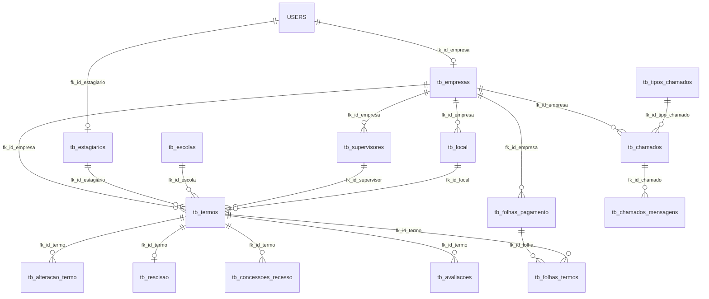

# Memória Descritiva de Software e Banco de Dados
## Sistema de Gestão de Estágios, Vagas e Concursos (SIGE)

---

### 1. Apresentação e Identificação do Software

O **SIGE (Sistema de Gestão de Estágios)** é uma plataforma integrada de gestão operacional, administrativa e financeira desenvolvida em arquitetura web moderna. O sistema foi projetado para atuar como um Hub corporativo que conecta unidades concedentes (empresas), instituições de ensino (escolas), estagiários, supervisores de estágio, candidatos a processos seletivos públicos (concursos) e operadores administrativos.

O sistema divide-se em três grandes frentes de atuação tecnológica:
1. **Gestão de Estágios e Contratos (TCE)**: Automação completa do fluxo de contratação de estagiários, controle de limites por empresa, aditivos de alteração, rescisões, controle de recesso, avaliações automáticas de desempenho e assinatura digital de documentos via integração com ZapSign.
2. **Portal de Vagas e Candidaturas**: Painel para empresas publicarem oportunidades de estágio e emprego, com área pública de busca, envio de currículos e sincronização automática com o cadastro de contratos.
3. **SIGE Concursos**: Módulo completo para elaboração e controle de concursos públicos e processos seletivos. Permite cadastrar órgãos públicos, editais, cargos, locais de prova e salas, executar o algoritmo de alocação automática e balanceada de candidatos por sala, homologar inscrições (com exportação financeira de taxas e isenções) e emitir folhas de presença de provas.

---

### 2. Especificação da Arquitetura Tecnológica

A plataforma foi construída seguindo padrões de engenharia de software de alta performance, portabilidade e segurança:
* **Backend Framework**: Laravel (PHP 8.1+), empregando o padrão arquitetural MVC (Model-View-Controller), ORM Eloquent para abstração e segurança das transações do banco de dados, e Jobs assíncronos/agendados para tarefas em background.
* **Database Engine**: MySQL (5.7 ou superior), utilizando índices otimizados nas chaves de relacionamento, transações SQL acopladas (para garantir a integridade dos dados em caso de falhas) e restrições de chave estrangeira (FK) em nível de banco de dados.
* **Frontend e UI**: Blade templates integrados a bibliotecas JavaScript assíncronas (AJAX via Axios/Fetch) e CSS Vanilla estruturado de alto desempenho. A navegação de buscas utiliza Select2 dinâmico para otimizar a renderização de grandes volumes de registros.
* **Portabilidade Móvel (PWA)**: O sistema opera também como um PWA (*Progressive Web App*). Possui Service Worker configurado para controle de cache, manipulação offline de ativos essenciais e manifest de instalação que permite que o sistema seja adicionado como aplicativo nativo em dispositivos móveis Android e iOS.

---

### 3. Diagrama de Casos de Uso (UML)

O diagrama de casos de uso a seguir ilustra as principais interações de cada ator (Administrador/Operador, Unidade Concedente, Estagiário e Candidato Público) com os diferentes módulos do SIGE.

```mermaid
graph TD
    subgraph Atores do Sistema
        Admin[Administrador / Operador]
        Empresa[Unidade Concedente - Empresa]
        Estag[Estagiário]
        Cand[Candidato Público]
    end

    subgraph Funcionalidades Administrativas
        Admin --> AD1(Gerenciar Estagiários, Escolas e Supervisores)
        Admin --> AD2(Gerar e Editar Termos de Estágio - TCE)
        Admin --> AD3(Enviar e Sincronizar Assinaturas ZapSign)
        Admin --> AD4(Processar Folha e Remessas em Lote)
        Admin --> AD5(Gerenciar Chamados e Atribuir Responsáveis)
        Admin --> AD6(Administrar Concursos e Alocação de Salas)
    end

    subgraph Funcionalidades da Empresa
        Empresa --> EM1(Publicar e Gerenciar Vagas de Estágio)
        Empresa --> EM2(Visualizar Candidaturas e Currículos)
        Empresa --> EM3(Abrir e Responder Chamados de Suporte)
        Empresa --> EM4(Consultar Contratos e Histórico)
    end

    subgraph Funcionalidades do Estagiário
        Estag --> ES1(Atualizar Perfil e Upload de Documentos)
        Estag --> ES2(Visualizar Contratos e Detalhes)
        Estag --> ES3(Gerar Links de Avaliação de Desempenho)
        Estag --> ES4(Recuperar Login por CPF)
    end

    subgraph Funcionalidades de Concursos
        Cand --> CA1(Buscar Vagas e Candidatar-se)
        Cand --> CA2(Realizar Inscrição em Concursos Públicos)
        Cand --> CA3(Consultar Local de Prova e Resultado)
    end
```



---

### 4. Modelagem de Banco de Dados (DER)

A modelagem de dados do SIGEBR é altamente normalizada e estruturada para garantir velocidade de consulta e integridade referencial física. 

Devido à grande escala e alta complexidade de tabelas do banco de dados completo, o diagrama técnico foi exportado em formato vetorial de alta definição (SVG). Ele permite aproximação (zoom) sem perda de qualidade para inspeção detalhada de colunas, chaves primárias (PK) e estrangeiras (FK).

* 📂 **Diagrama Completo em Alta Definição**: [sigebr_der_completo.svg](file:///c:/Users/pedro/Documents/GitHub/cursolaravel/docs/sigebr_der_completo.svg) (Recomendado abrir no navegador web para navegação interativa)

Abaixo está o modelo conceitual simplificado das relações centrais do ecossistema SIGEBR:



---

### 5. Detalhamento Funcional e Técnico dos Módulos

#### 5.1. Módulo de Estagiários, Escolas e Supervisores
Este módulo lida com as entidades base do sistema de estágios.
* **Segurança e Validação no Upload de Documentos**: O estagiário pode gerenciar seu cadastro e anexar fotos de seus documentos pessoais, comprovante de residência e comprovante de escolaridade. Para mitigar instabilidades e falhas de envio de arquivos pesados, o sistema implementa:
  * Limite robusto de upload de **5MB** (`max:5120`) para PDFs e imagens de alta resolução.
  * Validação no lado do cliente (tamanho e formato) combinada a tratamento de erros por transação SQL no backend. Se houver falha de persistência física do arquivo, o banco de dados sofre rollback automático e o arquivo é apagado, evitando registros corrompidos ou órfãos.
  * A exclusão física do arquivo antigo no servidor ocorre unicamente após a confirmação total de gravação bem-sucedida do novo arquivo.
* **Pesquisa Rápida de Usuários**: Painel administrativo dinâmico que centraliza buscas de estagiários (por CPF, nome ou e-mail de login) e empresas (por CNPJ, nome ou e-mail de login), retornando no máximo 50 resultados instantâneos via requisições assíncronas.
* **Recuperação de Login Automática**: Interface dedicada para estagiários que possuem cadastro de estágio existente, mas que não possuem credenciais de acesso ao portal. O sistema sanitiza o CPF informado, consulta a tabela física e, caso confirme a inexistência de um login ativo vinculado àquele registro, renderiza o formulário seguro para definição instantânea de e-mail e senha de primeiro acesso.

#### 5.2. Gestão de Termos (TCE) e Aditivos
A geração do Termo de Compromisso de Estágio (TCE) é o coração operacional do módulo de estágios.
* **Princípio da Auditoria e Campos Fixos**: Para evitar perdas de histórico em decorrência de atualizações de cadastro das empresas ou dos estagiários após a assinatura física do contrato, a tabela `tb_termos` trabalha com o padrão de espelhamento estrutural. Os valores atuais de cargo, horário, atividades e supervisor são salvos nos campos normais e gravados permanentemente em colunas específicas terminadas com a nomenclatura `_fixo` (ex: `desc_atividades_fixo`, `valor_bolsa_fixo`, `horario_fixo`). Estes campos históricos jamais são alterados, preservando o valor jurídico exato do momento da assinatura do TCE.
* **Aditivos de Alteração e Rescisão**: Quando há mudanças em um contrato em andamento, o operador cria uma `tb_alteracao_termo` (aditivo), que mantém a relação histórica do supervisor anterior, bolsa anterior e término anterior frente aos novos dados pactuados. A rescisão prematura de um estágio gera a criação do registro na `tb_rescisao`, mudando o status do termo para inativo e desvinculando automaticamente eventuais vagas reservadas.
* **Regras de Negócio de Acesso e Limite de Estagiários**: O sistema controla limites individuais de estágios ativos por empresa e restringe visualizações: empresas e estagiários acessam apenas dados associados aos seus IDs, enquanto operadores e administradores dispõem de visão global.

#### 5.3. Integração ZapSign (Assinaturas Eletrônicas)
O SIGE é integrado à ZapSign para digitalização de assinaturas contratuais.
* **Fluxo Operacional**: Após a criação do termo ou do aditivo de alteração de contrato pelo operador, o sistema dispara os metadados do documento em formato PDF para a ZapSign através da API rest. A ZapSign retorna um token exclusivo (`zapsign_doc_token`) e define o status de assinatura para `pendente`.
* **Notificação e Sincronização por Webhooks**: O SIGE possui uma rota pública segura de webhook que escuta os eventos gerados pela ZapSign. Quando as partes concluem a assinatura do documento digital, a ZapSign envia uma notificação POST que é capturada pelo backend. O sistema atualiza o status na tabela `tb_termos` para `assinado`, armazena os logs da transação na tabela `ZapSignWebhookLog` e disponibiliza o download do PDF assinado no painel do estagiário e da empresa concedente.

#### 5.4. Módulo de Vagas e Candidaturas
Este subsistema automatiza a captação de talentos por parte das empresas contratantes.
* **Publicação de Vagas**: Cada empresa pode cadastrar suas oportunidades de estágio com número sequencial anual gerado automaticamente por organização no formato `ANO-SEQUENCIA` (ex: `2026-0001`).
* **Área Pública, Candidaturas e Integração de Fluxo**:
  * As vagas com sinalizadores de divulgação pública habilitados são listadas abertamente na interface para buscas de candidatos externos.
  * O envio de candidatura exige o anexo obrigatório de currículo (PDF/Doc) limitado a 5MB.
  * O painel interno permite às empresas avaliarem candidaturas, mudarem status curriculares e escolherem o estagiário vencedor do certame (enviando e-mail de feedback automatizado ao candidato).
  * Ao selecionar a contratação do estagiário, o sistema marca a vaga como "estagiário definido". Quando o operador inicia o formulário de cadastramento de um novo termo (TCE) para esta vaga, os dados do estudante e as atividades/bolsa da vaga são automaticamente pré-carregados na tela, otimizando o tempo de preenchimento.

#### 5.5. Módulo de Avaliações de Estágio
Automatiza a avaliação periódica de desempenho exigida pela legislação federal de estágios (Lei nº 11.788/2008).
* **Geração de Avaliações**: O sistema gera automaticamente avaliações com base no tipo `seis_meses` (ao completar 6 meses de vigência ativa do contrato) ou `finalizacao` (vinculada à criação de uma rescisão de contrato). Um serviço agendado no Laravel (`GerarAvaliacoesAutomaticasJob`) roda diariamente às 02:00, verificando os termos que atingiram os marcos temporais, persistindo os registros na tabela `tb_avaliacoes` com status `pendente` e questões padrão estruturadas em formato JSON.
* **Formulários Públicos e Segurança por Token**: O operador ou o próprio estagiário pode obter um link único seguro baseado em um token gerado criptograficamente com 32 bytes aleatórios (`bin2hex(random_bytes(32))`). Este link é enviado ao supervisor de estágio. O formulário público de resposta não exige que o supervisor esteja autenticado na plataforma; ele acessa diretamente a página do token, valida seu e-mail corporativo, responde à escala de perguntas e submete as avaliações de desempenho. O token é permanentemente invalidado e expirado no exato instante do envio das respostas.

#### 5.6. Módulo de Folha de Pagamento
* **Processamento de Dados em Lotes**: Visando suportar milhares de contratos simultâneos sem gargalos de memória PHP ou estouro de tempo de execução (*timeout*), o sistema efetua os cálculos de remuneração (Bolsa + Auxílio Transporte diário/mensal - Descontos) salvando as transações na tabela `tb_folhas_termos` através de lotes compactos (*batches*).
* **Remessas Bancárias**: Permite agrupar os lançamentos mensais homologados e gerar arquivos de remessa bancária divididos em lotes com limitador máximo de registros, respeitando os layouts específicos de tráfego bancário nacional para pagamento automatizado aos estagiários.

#### 5.7. Módulo de Chamados (Suporte)
Facilita a comunicação entre a unidade concedente e a operadora administrativa.
* **Formulários Contextuais**: Ao solicitar suporte técnico ou operacional, a empresa seleciona o tipo de chamado. O sistema apresenta formulários específicos para:
  * **Rescisão**: Exige vinculação do termo de compromisso e data final.
  * **Alteração de Termo**: Exige vinculação do termo e preenchimento da alteração proposta.
  * **Chamado Genérico**: Cadastro de dúvidas, falhas ou solicitações com upload de até 5 anexos de no máximo 5MB.
* **Chat Interno de Atendimento**: O detalhe de cada chamado funciona como uma sala de chat assíncrona bidirecional. O sistema emprega estados visuais de loading para prevenir duplicidade de envio de mensagens sob cliques repetidos.
* **Atribuição e Notificações Inteligentes**: Administradores podem definir um operador responsável pelo atendimento do chamado. As notificações automáticas de e-mail funcionam sob a lógica: se houver um responsável corporativo definido na tabela `tb_chamados`, apenas ele receberá avisos quando a empresa enviar novas mensagens no chat; caso o chamado permaneça sem responsável, todos os operadores ativos são notificados.

#### 5.8. Módulo SIGE Concursos (Processos Seletivos)
Módulo isolado projetado para a criação e acompanhamento de seleções públicas e concursos corporativos.
* **Estrutura de Cadastro de Processos**: Cadastro independente de Órgãos Públicos, Editais de Processos (`sigeconcursos_tb_processos`), Cargos, Vagas imediatas/Cadastro reserva, Remunerações por processo, Casos de Isenção de taxa e Documentos exigidos na inscrição.
* **Locais de Prova e Salas**: Cadastro de locais de aplicação de prova com endereçamento geográfico e suas respectivas salas, indicando a capacidade física de assentos de cada sala de aula.
* **Algoritmo de Distribuição por Salas**: O sistema executa o particionamento automático e balanceado dos candidatos inscritos e homologados nos locais de prova selecionados. O algoritmo calcula a menor quantidade necessária de salas para acomodar os inscritos de um determinado local, e distribui os candidatos nominalmente em ordem alfabética entre essas salas de forma simétrica (diferença máxima de no máximo 1 candidato entre as salas selecionadas), respeitando rigidamente a capacidade máxima de cada sala.
* **Hub Operacional Calculado**: Em vez de depender exclusivamente do controle manual do operador para transitar os status do concurso, a model `SigeConcursoProcesso` calcula dinamicamente o status atual de apresentação do certame (ex: *Inscrições Abertas, Homologação das Inscrições, Distribuição de Salas, Local de Prova Liberado, Etapas Finais*) confrontando as datas de início e término cadastrados com as operações reais já realizadas no banco (ex: se a distribuição de salas já foi efetuada e confirmada).
* **Emissão de Relatórios**: O sistema gera em formato PDF as **Listas de Presença por Sala** (um documento para cada sala contendo os dados do local, identificador da sala e as colunas nominais de assinatura e documentos dos candidatos em ordem alfabética de assentos) e a **Planilha de Homologação das Inscrições** em formatos Excel ou PDF (com opção de exportação com CPF censurado para resguardo de privacidade pública).

---

### 6. Políticas de Segurança e Integridade dos Dados

O SIGE implementa protocolos rígidos para garantir a confidencialidade e auditabilidade dos dados:
1. **Controle de Níveis de Acesso (RBAC)**: O controle de privilégios opera por verificação rígida de middlewares (`admin`, `operador`, `empresa`, `estagiario`). Rotas administrativas são inacessíveis para empresas ou estagiários mesmo via manipulação direta de parâmetros de URL.
2. **Criptografia e Tokens Seguros**: Links públicos sensíveis (como respostas de avaliações de desempenho) utilizam tokens alfanuméricos gerados de forma pseudo-aleatória criptográfica, com invalidação instantânea pós-uso.
3. **Auditoria Contratual**: O espelhamento físico em colunas `_fixo` impede fraudes retroativas em termos contratuais e garante integridade histórica nas auditorias fiscais.
4. **Resiliência e Proteção contra Transações Incompletas**: Métodos críticos de alteração contratual, uploads múltiplos de chamados e distribuição de candidatos por sala operam protegidos por transações SQL (`DB::beginTransaction()`, `DB::commit()`, `DB::rollBack()`), garantindo que falhas elétricas ou de infraestrutura de rede durante o processamento de banco de dados revertam o sistema ao último estado consistente.

---

### 7. Requisitos de Instalação e Execução Técnica (Setup)

#### Requisitos do Servidor
* Servidor Web (Apache com `mod_rewrite` ativo ou Nginx).
* PHP 8.1 ou superior (extensões requeridas: `pdo_mysql`, `mbstring`, `openssl`, `xml`, `gd`, `zip`).
* Banco de Dados MySQL 5.7+ ou MariaDB 10.3+.
* Composer (gerenciador de dependências PHP) e Node.js com NPM (para build de assets frontend).

#### Passos para Inicialização do Sistema
1. Clonar o repositório no servidor web.
2. Criar e configurar as variáveis de ambiente no arquivo `.env` (credenciais de conexão MySQL, credenciais SMTP de e-mail e chave de API do ZapSign).
3. Instalar as dependências do backend PHP:
   ```bash
   composer install --no-dev --optimize-autoloader
   ```
4. Instalar as dependências e executar o build do frontend:
   ```bash
   npm install && npm run build
   ```
5. Executar as migrações estruturais do banco de dados para criação de todas as tabelas descritas nesta documentação:
   ```bash
   php artisan migrate
   ```
6. Executar os Seeders para populamento de tabelas auxiliares fundamentais (ex: tipos iniciais de chamados, cidades e estados):
   ```bash
   php artisan db:seed
   ```
7. Criar o link simbólico de storage para acesso público a arquivos e uploads de comprovantes e fotos:
   ```bash
   php artisan storage:link
   ```
8. Adicionar a entrada do cron de tarefas agendadas do Laravel ao cron do servidor operacional para automação de tarefas diárias (como as avaliações automáticas de 6 meses):
   ```bash
   * * * * * cd /caminho-da-sua-aplicacao && php artisan schedule:run >> /dev/null 2>&1
   ```
